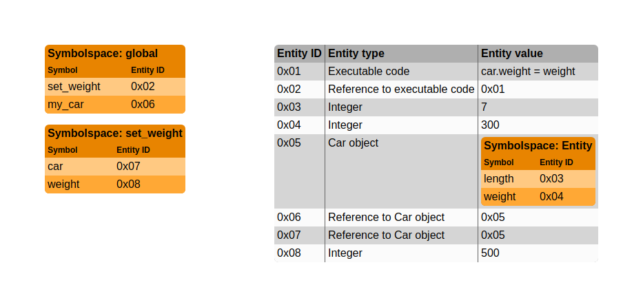

# 0. Software reuse

## Entities and symbols

### Entities

In software, **_entities_** fall into two categories:

- **_Data entities_**.
- **_Executable entities_**.

Examples of **_data entities_** include:

- Integers.
- Strings.
- Objects.

Examples of **_executable entities_** include:

- Functions.
- Subroutines.

### Symbols

A **_symbol_** is a textual name that we use to refer to an
**_entity_**. For example:

- An integer `foo` is a **_data entity_**, and we use the **_symbol_**
  "foo" to refer to it.
- A function `frobnicate` is an **_executable entity_**, and we use the
  **_symbol_** "frobnicate" to refer to it.

### Symbolspaces

A **_symbolspace_** is a set of **_symbols_**. Within a single
**_symbolspace_**, identical **_symbols_** refer to identical
**_entities_**.

The set of symbols in a **_symbolspace_** is the set of all **POSSIBLE**
symbols that could refer to separate **_entities_**. In other words,
even if the **_symbol_** "bar" in our **_symbolspace_** does not refer
to an entity, "bar" is still in our **_symbolspace_**.

#### Example 1

Consider a procedural language for a graphing calculator. The language
mandates that a symbol must consist solely of a single uppercase capital
Latin letter.

Any code written for the graphing calculator is restricted to the
symbolspace:

```
symbolspace = {A, B, C, D, E, F, G, ..., W, X, Y, Z}
```

#### Example 2

Consider a small procedural language that mandates that a symbol must
consist solely of uppercase Latin letters. The minimum length of a
symbol is 1 letter, and the maximum length of a symbol is 3 letters.

Any code written in this procedural language is restricted to the
symbolspace:

```
symbolspace = {A, B, ..., Y, Z, AA, AB ..., ZY, ZZ, AAA, AAB, ..., ZZY, ZZZ}
```

#### Example 3

Consider the Bourne shell, `sh`. The Bourne shell mandates that a symbol
must consist solely of underscores, Arabic numerals ("0" through "9"),
and Latin letters (both uppercase and lowercase). The first character of
a symbol cannot be an Arabic numeral. A symbol must contain at least one
character. There is no upper limit on the length of a symbol.

In this case, there are infinite symbols within the symbolspace.
However, we can say for sure that the following symbols are **NOT** in
the symbolspace:

- "%abc%" is not in the symbolspace because "%" is not allowed in a
  symbol.
- "" (empty symbol) is not in the symbolspace because a symbol must
  contain at least one character.
- "0" is not in the symbolspace because a symbol cannot start with a
  digit.

#### Example 4

Consider 64 kibibytes (KiB) of physical memory (RAM). Each memory
address is a symbol.

Any program loaded into this memory must fit within the symbolspace:

```
# Hexadecimal notation
symbolspace = {0x0000, 0x0001, 0x0002, ..., 0xFFFD, 0xFFFE, 0xFFFF}
```

#### Example 5

Consider the following Python code fragment:

```python
# Python

# BEGIN CODE FRAGMENT

x = 1

def f(x):
    x = x + 3 # This does not modify the "x" entity in the global symbolspace.
    return x * 2

# END CODE FRAGMENT

# For illustrative purposes only:
print(f(2)) # Prints "10".
print(f(x)) # Prints "8".
print(x) # Prints "1" (global "x" was not modified by call to "f").
```

There are two symbolspaces in this code fragment:

- The code fragment mentions the following symbols in the global
  symbolspace:
  - Symbol "x" refers to a data entity.
  - Symbol "f" refers to an executable entity.
- The function `f` has its own symbolspace. The code fragment mentions
  the following symbols in `f`'s symbolspace:
  - Symbol "x" refers to a data entity that is local to `f`.

Notice that the symbol "x" in `f`'s symbol space does not refer to the
same entity as symbol "x" in the global symbol space. The two instances
of the symbol "x" refer to seprate entities. That is why setting `x = x + 3`
in the body of `f` does not modify the global `x`. In other words, we
have one symbol, "x", but it is referring to two seprate entities.
Therefore, we have two separate symbolspaces.

#### Example 6

Consider the following Python code fragment:

```python
# Python

# BEGIN CODE FRAGMENT

x = 1
y = 4

def f(z):
    x = y + 3 # "y" refers to the same entity as the global "y".
    return z * x

# END CODE FRAGMENT

# For illustrative purposes only:
print(f(2)) # Prints "14".
print(f(x)) # Prints "7".
print(x) # Prints "1" (global "x" was not modified by call to "f").
```

There are two symbolspaces in this code fragment:

- The code fragment mentions the following symbols in the global
  symbolspace:
  - Symbol "x" refers to a data entity.
  - Symbol "y" refers to a data entity.
  - Symbol "f" refers to an executable entity.
- The function `f` has its own symbolspace. The code fragment mentions
  the following symbols in `f`'s symbolspace:
  - Symbol "x" refers to a data entity that is local to `f`.
  - Symbol "y" refers to the same data entity that symbol "y" in the
    global symbolspace refers to.
  - Symbol "z" refers to a data entity that is local to `f`.

In this example, notice that in both symbolspaces, the symbol "y" refers
to the same data entity. It is possible for the same symbol to appear in
multiple symbol spaces, and refer to the same entity.

#### Example 7

Consider the following Python code fragment:

```python
# Python

# BEGIN CODE FRAGMENT

x = 1
x = 2
x = 3

# END CODE FRAGMENT
```

In this example, entity `x` changes value. However, the symbol "x" is
always referring to the same entity.

In other words, it would be incorrect to say "the symbol "x" refers to
the value `3` at the end of the code fragment". Rather, the symbol "x"
refers to a single entity throughout the code fragment, and that entity
holds different values throughout the execution of the code fragment. At
the end of the code fragment, the entity holds the value `3`.

This illustrates the fact that within a symbolspace, the same symbol
always refers to the same entity.

#### Example 8

Consider the following Python code fragment:

```python
# Python

def set_weight(car, weight):
    car.weight = weight

class Car:

    def __init__(self, length, weight):
        self.length = length
        self.weight = weight

# Construct new "Car" object and return a REFERENCE to the created object.
my_car = Car(7, 300)

set_weight(my_car, 500) # Line 15

# For illustrative purposes only:
print(my_car.weight) # Prints "500".
```

When we enter the `set_weight` function at line 15, we have the
following symbols and entities:



Notice that `my_car` and `car` refer to separate entities. They both
refer to reference entities, which in turn refer to a `Car` object. In
this case, both entities refer to the same `Car` object: entity 0x05. In
other words, if we set `car = 128` in the function `set_weight`, then
the value in entity 0x07 becomes 128, the type of entity 0x07 becomes
"integer", and the values in entities 0x05 and 0x06 remain unchanged.

On the other hand, when we set `car.weight = weight` in the function
`set_weight`, this modifies entity 0x04. Since entity 0x04 is also
reachable from the global symbolspace, we can observe the change after
the `set_weight` function returns. This is an example of **_aliasing_**.

We might be tempted to treat `car.weight` as a symbol in `set_weight`'s
symbolspace. However, this would be incorrect because `car.weight` is
not guaranteed to always refer to the same entity. For example, if we
set `car = Car(8, 700)`, then `car.weight` no longer refers to entity
0x04. Compare this to `car`, which **IS** a symbol in `set_weight`'s
symbolspace; no matter what we do within the body of `set_weight`, `car`
will always refer to entity 0x07.

So, `car.weight` is not a symbol. Instead, it's better to think of the
`Car` object (entity 0x05) as containing a symbolspace as its value.
When we add `.weight` to the end of `car`, we are refering to the
`weight` symbol in entity 0x05's symbolspace (which is entity 0x04 in
this case).

*Note: In Python, the symbol "Car" in the global symbolspace refers to
an entity which is a reference to a "class object". This detail has been
omitted in the figure.*

#### UNORGANIZED

What kind of entity is a class? That depends on the level of abstraction
you are working in.

Conceptually, a class is more like a **_symbolspace_** than a full fledged **_entity_**.

Though, in many languages, a class is itself an object with an address
in physical memory.

What about objects (i.e. instances of classes) which have both data
attributes and executable attributes? For example, an instance of a
`Car` class could have a `Car.weight` attribute which is a
**_data entity_**, and a `Car.drive` attribute which is an
**_executable entity_**. In this case, the `Car` instance itself is a
**_data entity_**, and it refers to a 

## Symbolspaces and namespaces


# 1. Notation

## Logical notation

### And

The following statements are equivalent:

- `A` and `B` are true.
- `A ∧ B`.

### Or

The following statements are equivalent:

- Either `A` is true, `B` is true, or both `A` and `B` are true.
- `A ∨ B`.

### Implication

The following statements are equivalent:

- Whenever `A` is true, `B` is also true.
- `A` implies `B`.
- `A -> B`.

Notice that `A -> B` is not equivalent to `B -> A`.

### Equivalence

The following statements are equivalent:

- `A` and `B` have the same truth values.
- `A` implies `B` and `B` implies `A`.
- `(A -> B) ∧ (B -> A)`.
- `A <-> B`.

# 1. Modelling

## Variable

### Definition

A **variable** is an abstract entity which has a name and holds a value.

### Notation

A variable is denoted by its name. For example:

- A variable named "a" is denoted by `a`.
- A variable named "foo" is denoted by `foo`.

A variable with a value is denoted as a name / value tuple. For example:

- A variable named "a" with value "0" is denoted by `(a, 0)`.
- A variable named "foo" with value "bar" is denoted by `(foo, bar)`.

## Model

### Definition

A **model** is a set of relevant variables.

### Notation

A model is denoted by a list of variables in set notation. For example:

- A model consisting of three variables, `a`, `b`, and `c`, is denoted
  by `{a, b, c}`.
- A model consisting of two variables, `foo` and `bar`, is denoted by
  `{foo, bar}`.

## Modelling

### Introduction

It is often helpful to define a model to more effectively analyze a
piece of software. Models vary in their level of abstraction and detail.

For instance, consider a non-recursive factorial function written in
Python:

```python
def factorial(n):
    result = 1
    while n != 0:
        result = result * n
        n = n - 1
    return result
```

To anaylze this function for correctness, a model `{n, result}` will
suffice.

Now consider a recursive factorial function written in Python:

```python
def factorial(n):
    if n == 0:
        return 1
    else:
        return n * factorial(n - 1)
```

A model `{n, return_value}` is not sufficient to analyze the recursive
function for correctness. We need a model that includes the value of `n`
in each recursive call, and accounts for the return value from each
recursive call. For example, a model consisting of a call stack where
each stack frame contains two variables `n` and `return_value` will
suffice.

We can go deeper and model the Python runtime engine itself. For
example, we could model it as a call stack, a free store, and a program
under execution.

If we were interested in analyzing the memory usage of a particular
Python implementation, for example CPython, we might model the software
as an array of memory elements and a program counter, where each memory
element contains either program data or processor instructions (much
like assembly language).

All of these are potentially useful models for analyzing the above
factorial functions. The selection of a model is subjective. As a
practical matter, you should select the simplest model that allows you
to analyze the software properties you are interested in.

### Definition

**Modelling** is the act of defining a model within which to analyze a
piece of software. 

## State

### Definition

A **state** is an instance of a model where each variable holds exactly
one value.

### Notation

A state is denoted by a list of variables with values in set notation.
For example:

- A state with variables `(a, 0)`, `(b, 1)`, and `(c, 3)` is denoted by
  `{(a, 0), (b, 1), (c, 3)}`.
- A state with variables `(foo, "foo_value")`, `(bar, "bar_value")` is
  denoted by `{(foo, "foo_value"), (bar, "bar_value")}`.

## Code

### Definition

A **code** is a unit of software.

## Synthesis

You can think of a **model** as an abstract machine with a fixed number
of **variable** elements. When a **model** executes a **code** it
changes **state** in response to the executed **code**.

The number of **variables** in the model does not change in response to
executed **code**; it remains fixed. The only things that change are the
values held by the **variables**.

## Terminology

### Variables

A variable **holds** a value. Alternatively, we can say a variable
**has** a value.

### Model coincidence

Alternative models of the same software system are said to **coincide**.
Coinciding models may differ in level of detail, level of abstraction,
or type of abstraction.

### Superset model

Model `A` is a **superset** of model `B` if and only if every element of
`B` is also an element of `A`.

### Subset model

Model `A` is a **subset** of model `B` if and only if every element of
`A` is also an element of `B`.

### Equal model

Model `A` is **equal** to a model `B` if all of the following are true:

- `A` is a superset of `B`.
- `B` is a superset of `A`.

In other words, `A` and `B` are equal if they contain the same
variables with the same values.

### State and model relationships

State `x` is **in** model `A` if and only if state `x` assigns one and
only one value to each variable in model `A`. Notice that state `x` may
include variables that are not in model `A`.

State `x` is **contained in** model `A` if and only if all of the
following are true:

- State `x` assigns one and only one value to each variable in model
  `A`.
- All varaibles in state `x` are in model `A`.

### State coincidence

If all of the following are true:

- State `x` is in model `A`.
- State `y` is in model `B`.
- Models `A` and `B` coincide.
- States `x` and `y` represent the same situation.

Then states `x` and `y` **coincide**.

State coincidence is an abstract concept. For example, consider the case
where:

- Model `A` is `{foo, bar}`.
- State `x` is `{(foo, 0), (bar, 1)}`.
- Model `B` is an array of memory elements and a symbol table pointing
  into the memory array.
- State `y` has a symbol table with `foo` pointing to a memory element
  with value `0` and `bar` pointing to a memory element with value `1`.

In this case, even though models `A` and `B` do not have a strict
superset / subset relationship, the two states `x` and `y` still
represent the same situation. State `y` contains additional information
(e.g. the memory location of `foo` and `bar`), but conceptually states
`x` and `y` coincide.

# 2. Roles

## Supplier and client

Code that is used by other code is a **supplier** of the other code.

Code that uses other code is a **client** of the other code.

For example:

```python
# Python
def f(x):
    return x + 1

def g(x):
    return f(x) * 2

def h(x):
    return f(x) + g(x)
```

In this example:

- `f` is a supplier of `g`. `g` is a client of `f`.
- `f` is a supplier of `h`. `h` is a client of `f`.
- `g` is a supplier of `h`. `h` is a client of `g`.

Notice that the terms "supplier" and "client" are relative. In some
contexts, a code acts as a supplier. In other contexts, that same code
acts as a client. For example:

- In the context of `f`, `g` is a client.
- In the context of `h`, `g` is a supplier.

## Developer and consumer

A **developer** is a person who writes code that other people use.

A **consumer** is a person who uses code written by other people.

Developer and consumer are the human counterparts to supplier and
client. Like supplier and client, developer and consumer are relative
terms.

## Undefined behavior

To understand what **undefined** means in software, it is helpful to
first review what undefined means in mathematics.

### Undefined in mathematics

Consider a piecewise function `f` in mathematics:

```
f(x) = {
  0, if x < 0
  1, if 0 <= x < 1
}
```

From the definition of `f`, we know that `f(-12) = 0` and `f(0.5) = 1`,
but what is `f(2)`? We say that `f(2)` is **undefined** because there is
no value defined for `x = 2` in the piecewise definition of `f` (in
mathematical terms: `2` is not in the "domain" of `f`).

Notice that `undefined` is not a value; it is not correct to say `f(2) =
undefined`. All we can say is that `f(2)` cannot be evaluated to a
value.

A more realistic example is a function `div` that divides two numbers:

```
div(x, y) = {
  x / y, if y != 0
}
```

You've probably heard that "dividing by zero is undefined". The
piecewise definition of `div` makes this fact explicit. We cannot
evaluate `div(3, 0)`.

We could make a new version of `div`, `div2`, that arbitrarily defines a
value for when `y == 0`:

```
div2(x, y) = {
  x / y, if y != 0
  4, if y == 0
}
```

With this definition, `div2(3, 0) = 4`. There is nothing special about
the value `4`; we could have used `5` or `6` just as easily. Of course,
our made up `div2` function has no mathematical significance.

### Undefined in software

In software, **undefined** behavior means "any arbitrary thing can
happen."

For example, let's translate our mathematical function `f` into Python:

```python
def f(x):
    if x < 0:
        return 0
    if x < 1:
        return 1
    # Some arbitrary behavior here.
```

Consider again our mathematical specification for `f`. If the consumer
calls `f(-12)` the consumer expects the return value to be `0` according
to the specification. If the consumer calls `f(0.5)` the consumer
expects the return value to be `1` according to the specification.

But if the consumer calls `f(2)`, then it's impossible for the developer
to know what behavior the consumer desires, because the developer did
not specify what `f(2)` was supposed to do. Therefore, we say that
calling `f(2)` results in **undefined** behavior. Since the value of
`f(2)` is not defined in the specification, the developer is free to do
anything he wants when the consumer calls `f(2)`.

The simplest alternative for the developer is to just leave the
undefined branch blank:

```python
def f(x):
    if x < 0:
        return 0
    if x < 1:
        return 1
    # Blank.
```

The developer could also return an arbitrary value:

```python
def f(x):
    if x < 0:
        return 0
    if x < 1:
        return 1
    return 4 # Return arbitrary value.
```

Or, the developer could loop forever:

```python
def f(x):
    if x < 0:
        return 0
    if x < 1:
        return 1
    while true: # Loop forever
        pass
```

The developer could also make `f(2)` do the any of following:

- Put the program in an invalid state (i.e. a state that violates some
  invariant).
- Terminate the program.
- Consume all available memory.
- Shut down the computer.
- Crash the airplane (in avionics software).
- Launch the missiles (in missile control software).

The possibilities of undefined behavior are endless.

## Errors and faults

A **fault** is an _instance_ of an **error**. In other words, an error is
a _category_ of fault.

For example, "division by zero" is an **error**. Executing a code that
divides by zero produces a "division by zero **fault**".

### Examples

#### Instructions (examples 1 - 2)

Identify the faults and errors in the following codes.

#### Example 1

```python
# Python
x = 3 / 0
y = 4 / 0
```

At runtime, this code produces two faults:

- Division by zero fault on line 2.
- Division by zero fault on line 3.

This code has one error:

- Division by zero.

#### Example 2

```python
# Python
def add_3(x):
    return x + 3

x = add_3(1) / 0
y = add_3()
z = 3 / 0
```

At runtime, this code produces three faults:

- Division by zero fault on line 5.
- Wrong number of arguments fault on line 6.
- Division by zero fault on line 7.

This code has two errors:

- Division by zero.
- Wrong number of arguments.

## Defects, errors, and faults

# 3. Specification

# Development by contract

# Trivial implementation

# Error handling

Erase from your mind the notion of "error handling". The only true
"error" that can occur is when a client invokes a supplier in a state
that causes undefined behavior. By definition, this represents a defect
in the client. There is nothing the developer can do to "handle" the
client's defect; it is the consumer's responsibility to fix the client.

Any so-called "errors" that are handled expicitly in code are better
thought of as full-fledged features. For example, catching an exception
is an intentional feature. Throwing an exception is an intentional
feature. Setting `errno` or some other error indication is an
intentional feature. These are all well-defined behaviors, behaviors
that the consumer can rely upon, and behaviors that the developer must
continue to support. Therefore, they are features, not defects.

As for the various "error handling" mechanisms available in programming
languages, it is best to think of these as additional means of
communication between supplier and client. Throwing an exception is
really just another flow of control mechanism. `errno` is just another
variable available for communication. These are not errors.

To reiterate: the only true "error" in code is when undefined behavior
occurs due to a defect in the code.

There is another type of conflict that is often incorrectly classified
as an "error": when a supplier does not do what the consumer expects. In
this case, the developer has two options:

- Add a feature to do what the consumer expects. This means more work
  and maintenance for the developer.
- Explicitly declare that the supplier shall produce undefined behavior
  when it is invoked the way the consumer is invoking it. This restricts
  the supplier's domain, and it means more work and maintenance for the
  consumer.


## Defects, errors, and faults

There is only one error:

- Undefined behavior.

# UNORGANIZED

## Change code into content

Example: recipe book. Initially "Pea Soup" is a class that inherits from
"Recipe". Eventually we need to define new recipes at runtime (they may
be hard-coded, or loaded from persistent storage), rather than making a
class for each new recipe.

## Assertions

An **assertion** is a logical predicate that applies to a model.

For example, consider a model `X = {a, b, c}`, and an assertion `Y <->
(a = 3)`. Assertion `Y` is true for all states in `X` that have `a`
holding the value `3`. For example, assertion `Y` is true for all of the
following states:

- `{(a, 3), (b, 0), (c, 0)}`.
- `{(a, 3), (b, 0), (c, 1)}`.
- `{(a, 3), (b, 1), (c, 0)}`.

Assertion `Y` is false for all of the following states:

- `{(a, 0), (b, 0), (c, 0)}`.
- `{(a, 1), (b, 0), (c, 1)}`.
- `{(a, 2), (b, 1), (c, 0)}`.

## Debugging assertions

## Fallacy: You can completely constrain a state with assertions

Consider a model `R = {a, b, c}`. If we want to use assertions to
identify a single state, we could try the following three assertions:

- `X <-> (a = 0)`.
- `Y <-> (b = 0)`.
- `Z <-> (c = 0)`.

There is only one state contained in model `R` that satisfies all three
assertions `X`, `Y`, and `Z`: state `{(a, 0), (b, 0), (c, 0)}`. At first
glance, it appears that our three assertions `X`, `Y`, and `Z`
completely describe and constrain the state of the program.

However, notice that I said there is only one state **contained in**
model `R` that satisfies the assertions. There are, in fact, multiple
states **in** model `R` that satisfy the assertions. For example, I'm
sure there are other variables in our program besides `a`, `b`, and `c`.
Perhaps we also have a global variable `d`, so that the following states
also satisfy assertions `X`, `Y`, and `Z`:

- `{(a, 0), (b, 0), (c, 0), (d, 1)}`
- `{(a, 0), (b, 0), (c, 0), (d, 2)}`
- `{(a, 0), (b, 0), (c, 0), (d, 3)}`

We thought we had completely described the state of the program with
assertions `X`, `Y`, and `Z`, but we have to remember that our model `R
= {a, b, c}` is not reality; it is just a model at a level of
abstraction that is convenient for analyzing our local code. There are
an infinite number of coincident models that contain more detail than
`R`; in those models, there are numerous states that satisfy assertions
`X`, `Y`, and `Z`.

Perhaps the most detailed model, `Q`, would include the value of every
electrical signal in the CPU and main memory, as well as the values of
all bits in non volatile memory. Such a model is not very useful for two
reasons:

- In addition to the code we are developing, other software running on
  the computer will affect the state in model `Q`. In general, we cannot
  predict what other software the consumer will be running, so we cannot
  fix the state in model `Q`.
- Typically, our code has to run in multiple environments. For example:
  different operating systems, different CPU's, different execution
  engines (e.g. for Python we have CPython, IronPython, PyPy, et
  cetera). Even for C code, the machine code generated depends on the
  compiler used, optimization level, debugging symbols, et cetera.

## Specification

## Truth: A completely constrained specification is the code itself

## Truth: You can only prove the correctness of a complete implementation

